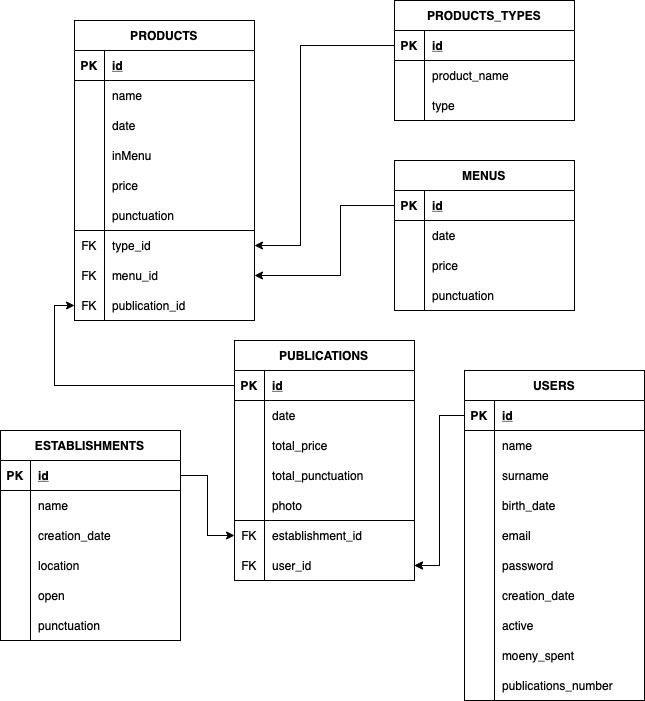

# TOTECO API

_Se trata de una aplicación de gestión de publicaciones de productos, estilo red social. La idea surge de poder crear una comunidad que publique fotos de desayunos incluyendo el precio de los productos y la puntuación._

## Modelo entidad relación 🔛


## Explicación de clases 🗂

_La API funciona de forma que puedes registrar usuarios, los cuales podrán crear las publicaciones.
Las publicaciones están compuestas por una imagen, la fecha de creación (coge automáticamente la del sistema), el precio total, la puntuación total, el id de usuario y el id del establecimiento.
A las publicaciones se le adhieren los productos. Cada producto tiene nombre, fecha de creación, precio, puntuación, el id del tipo, y, en el caso de que esté incluida en un menú, contiene también el id del menu. Si los productos pertenecen a una oferta o menú desayuno el precio de la publicación dependerá únicamente del precio del menú, mientras que sino el precio de la publicación es la suma del precio de los productos. En caso de la punctuación de la publicación sí que se obtiene de la suma de las puntuaciones tanto de menú como de productos. Para facilitar la inserción de productos se crea la tabla de tipos, donde se guarda el nombre del producto y el tipo (ejemplo: Tostada(nombre) de tomate(tipo)). Por último, está la tabla de establecimientos. En esta se guardan los datos del establecimiento (nombre, localización, si está abierto o no) y la puntuación del mismo que se calcula sumando las puntuaciones de las publicaciones de ese establecimiento y haciendo una media._

_Cada clase tiene una serie de filtros que se pueden aplicar. Todos ellos están recogidos en la colección de Postman incluida en el repositorio._

## Comenzando 🚀

_Estas instrucciones te permitirán obtener una copia del proyecto en funcionamiento en tu máquina local para propósitos de desarrollo y pruebas._


### Pre-requisitos 📋

_Cosas que necesitas para instalar el software y como instalarlas_

```
- Tener instalado java en el ordenador
- Programa que permita hacer despliegue Maven
- Programa que tenga instalados los plugins de Springboot y Lombok
- Programa de gestión de bases de datos mySQL
```

### Instalación 🔧

_Una serie de ejemplos paso a paso que te dice lo que debes ejecutar para tener un entorno de desarrollo ejecutandose_

```
- Clonar el este repositorio y situarse en la rama FINAL
- Importar el archivo SQL al interfaz de mySQL
- Importar la colección de Postman a Postman
```

## Despliegue 📦

_Pasos a seguir:_
* Inicia la base de datos
* Ejecuta spring boot
* Prueba las consultas de la colección de Postman

## Construido con 🛠️

* [Visual Studio Code](https://www.jetbrains.com/es-es/idea/) - Framework web usado
* [Maven](https://maven.apache.org/) - Gestor de dependencias
* [Spring Boot](https://spring.io/projects/spring-boot) - Fremework de creación de APIs
* [XAMPP](https://www.apachefriends.org/es/index.html) - Gestor de bases de datos
* [Postman](https://www.postman.com) - Plataforma de creación y uso de APIs

## Autores ✒️

* **Irene Cunto** - *Trabajo Principal y documentación* - [cunba](https://github.com/cunba)

También puedes mirar la lista de todos los [contribuyentes](https://github.com/cunba/toteco) que han participado en este proyecto.


---
⌨️ con ❤️ por [cunba](https://github.com/cunba) 😊